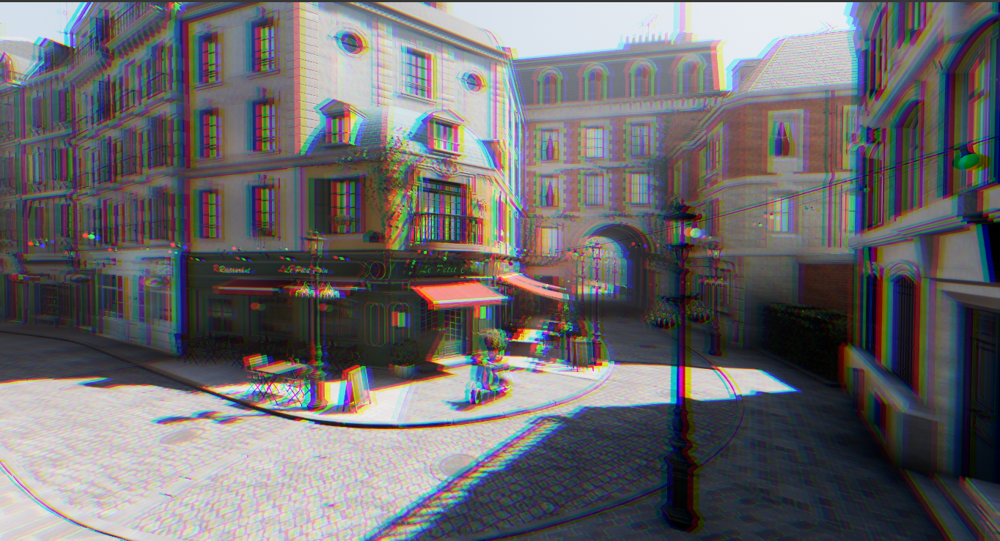
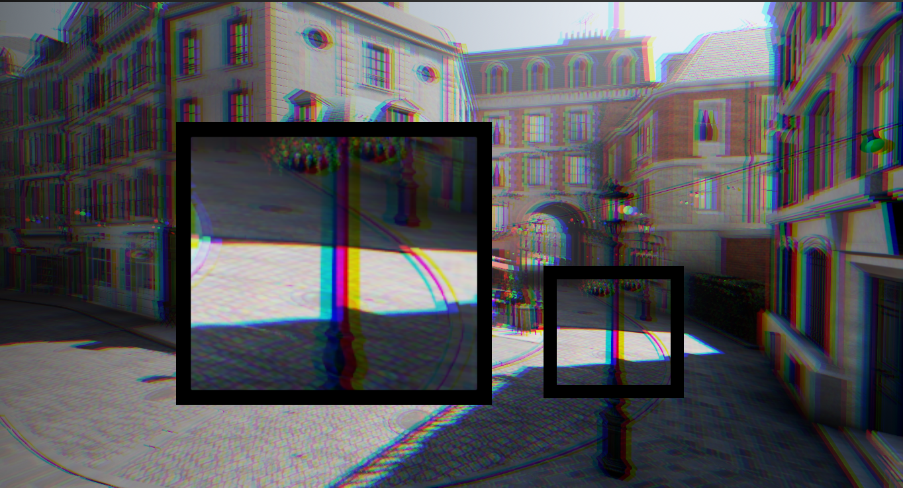
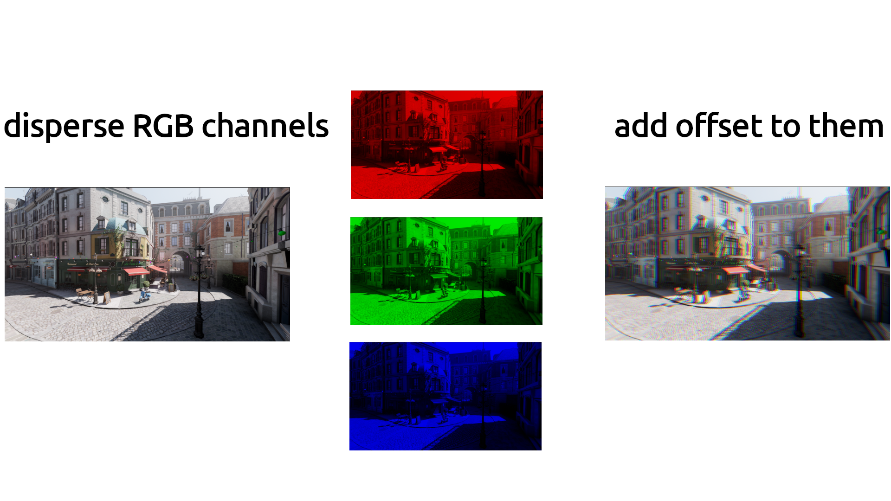
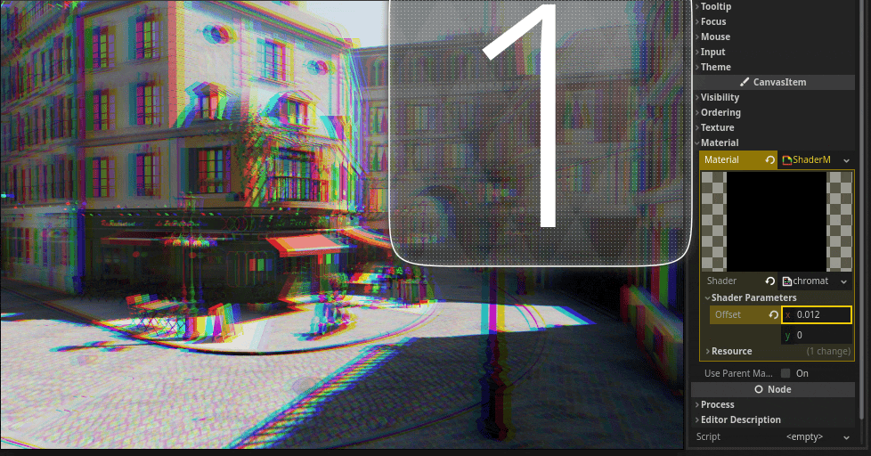

# Chromatic Aberration

Chromatic aberration also known as [Chromatic Distortion](https://en.wikipedia.org/wiki/Chromatic_aberration) is an optical phenomenon that occurs when different colors of light do not converge at the same point after passing through a lens, resulting in a dispersion of colored fringes around the edges.This effect is particularly noticeable in high-contrast areas of an image. 




we can deliberately introduce chromatic aberration as an artistic effect to add visual interest or a sense of distortion as well.

## How It Works?
To Create Chromatic Distortion, we can disperse the different color channels (RGB), by adding an offset to them.



## The Recipe
add a new ColorRect and make it Fullscreen and add a new ShaderMaterial to it and create a new shader for it([See How](./Chapters/Getting_Started/getting_started.html)).<br>
a new shader looks like this:
```glsl
shader_type canvas_item;

void fragment() {
	// Place fragment code here.
}

```
### step 1: Separate the image into its individual color channels
```glsl
shader_type canvas_item;
uniform sampler2D SCREEN_TEXTURE : hint_screen_texture, filter_linear_mipmap;

void fragment() {
	float r = texture(SCREEN_TEXTURE, SCREEN_UV).r;
	float g = texture(SCREEN_TEXTURE, SCREEN_UV).g;
	float b = texture(SCREEN_TEXTURE, SCREEN_UV).b;
}

```
we want to read the screen so we add this line to our shader ```uniform sampler2D SCREEN_TEXTURE : hint_screen_texture, filter_linear_mipmap;``` this tells Godot to assign the screen texture in this uniform that we called SCREEN_TEXTURE.

then we can sample this texture using the ```texture()``` function with the screen UV. that gives us the color for this pixel/fragment. we can then access each color using ```.r``` or ```.b``` and ```.g```.

we store each color channel in a variable named r, g and b.

### step 2: Apply a different offset to each color channel
```glsl
shader_type canvas_item;
uniform sampler2D SCREEN_TEXTURE : hint_screen_texture, filter_linear_mipmap;
uniform vec2 offset = vec2(0.002, 0.001);

void fragment() {
	float r = texture(SCREEN_TEXTURE, SCREEN_UV + offset).r;
	float g = texture(SCREEN_TEXTURE, SCREEN_UV).g;
	float b = texture(SCREEN_TEXTURE, SCREEN_UV - offset).b;
}

```

we need to move at least two of the three color channels so that we have a dispersion of the colors. in this case we want to move the Red and the Blue channels in opposite directions.

we can add a vector2 property called offset, so that we can control how much dispersion we have from the inspector and script.

then we can add this offset to the UV of one color channel and subtract it from another, this way those channel will move in opposite directions.

### step 3: Recombine the color channels

finally, we can combine the offseted r, g and b channels back together and use it for the result of our fragment shader.



<pre>
```
shader_type canvas_item;
uniform sampler2D SCREEN_TEXTURE : hint_screen_texture, filter_linear_mipmap;
uniform vec2 offset = vec2(0.002, 0.001);

void fragment() {
	float r = texture(SCREEN_TEXTURE, SCREEN_UV + offset).r;
	float g = texture(SCREEN_TEXTURE, SCREEN_UV).g;
	float b = texture(SCREEN_TEXTURE, SCREEN_UV - offset).b;

	COLOR = vec4(r, g, b, 1.0);
}

```
</pre>

<script>
	function CopyToClipboard(params) {
  const codeContainer = document.getElementsByTagName('pre');
  // debugger
  for (const item of codeContainer) {
    const button = document.createElement('button');
    button.innerText = 'Copy';
    button.style.position = 'absolute';
    button.style.top = "0";
    button.style.right = "0";
    button.style.fontSize = "10px";
    button.style.border = "none";
    button.style.background = "gainsboro";
    button.style.borderRadius = "0px 3px 0px 3px";
    button.className = 'copy-btn';
    button.onclick = function () {
      let x = item.firstChild.textContent
      console.log('iiner', x)
      const el = document.createElement('textarea');
      el.value = x;
      document.body.appendChild(el);
      el.select();
      document.execCommand('copy');
      document.body.removeChild(el);
      button.innerText = 'Copied';
      setTimeout(() => {
        button.innerText = 'Copy';
      }, 1000);
    };
    item.append(button);
  }
}

export default CopyToClipboard;
</script>