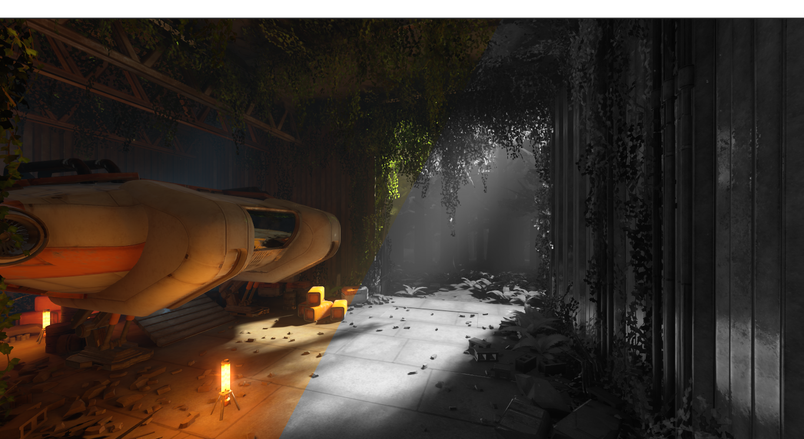
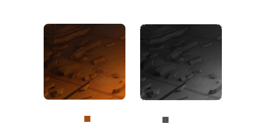
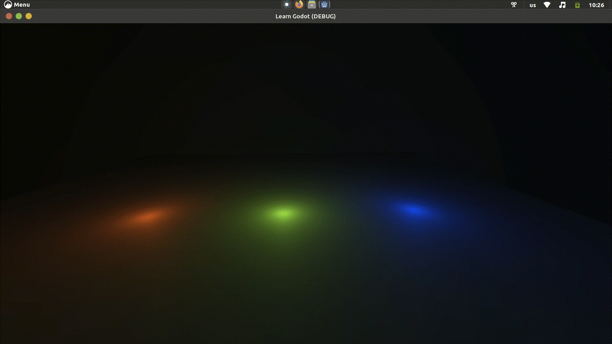
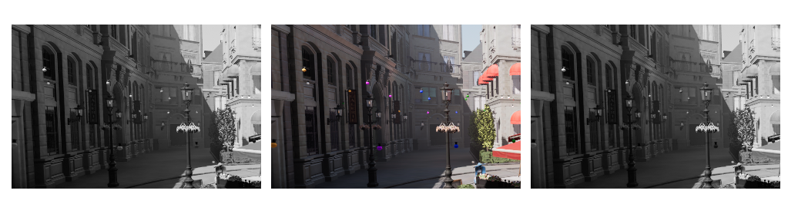

# Grayscaling 

an image can be broken down into two components: the [Chroma](https://en.wikipedia.org/wiki/Chrominance) (Color) and the [Luma](https://en.wikipedia.org/wiki/Luma_(video)) (Brightness). if we desaturate an image completely (remove color), what is left is the [Grayscaled](https://en.wikipedia.org/wiki/Grayscale) version of that image. <br>
some people might refer to grayscale as "black and white", however that's not a technically accurate term for that. black and white would mean that all the pixels of the image is either black or white, the image would be made of only 2 colors ([Binary Image](https://en.wikipedia.org/wiki/Binary_image)). a grayscale image on the other hand could be made of 50 shades of gray (usually much more).<br>
<br>
## How It Works?
to grayscale the screen our fragment shader runs for every pixel and replace the color with a shade of gray that represents the brightness of that pixel.<br>

## The Recipe
add a new ColorRect and make it Fullscreen and add a new ShaderMaterial to it and create a new shader for it([See How](./Chapters/Getting_Started/getting_started.html)).<br>
a new shader looks like this:
```glsl
shader_type canvas_item;

void fragment() {
	// Place fragment code here.
}

```
### step 1: get the pixel color

our grayscale shader needs to read the screen, we do that like so:
```glsl
shader_type canvas_item;
uniform sampler2D SCREEN_TEXTURE : hint_screen_texture, filter_linear_mipmap;

void fragment() {
	vec4 pixelColor = texture(SCREEN_TEXTURE, SCREEN_UV);
}

```
we add a uniform called```SCREEN_TEXTURE```(you can call it anything you like).<br> 
The uniform declaration for```SCREEN_TEXTURE```includes two hints:```hint_screen_texture```and```filter_linear_mipmap```. ```hint_screen_texture```tells Godot that this uniform should be automatically set to the screen texture, and```filter_linear_mipmap```specifies that the texture should be filtered using linear interpolation and mipmapping. These hints help ensure that the screen texture is sampled correctly and efficiently in the shader.<br>
we then sample the```SCREEN_TEXTURE```into a variable called```pixelColor```using the```texture()```function.<br>
the```pixelColor```variable now holds the color of the current pixel, we'll use it to calculate the brightness.<br>
### step 2: calculate the pixel brightness
there are two methods for calculating the pixel brightness:

- averaging the RGB channels
- dotting the RGB with the "Luma Coefficients"

#### method 1
a pixel is made of a Red, Green and Blue channel and if all of them are equal then it's not either Red, Green or Blue; it's Grayscaled!<br> 
this method simply averages the red, green, and blue values of the pixel color to calculate the brightness of the pixel which will then be set to the RGB channels of the same pixel. This is a simpler and more straightforward method.


```glsl
float pixelBrightness = (pixelColor.r + pixelColor.g + pixelColor.b) / 3.0;

```

#### method 2
this method uses the [Dot Product](https://en.wikipedia.org/wiki/Dot_product) of the pixel color (in RGB format) and a vector of weights (0.299, 0.587, 0.114) known as the 'Luma Coefficients' to calculate the brightness. This method is based on the fact that the human eye is more sensitive to green light than to red or blue, so the weights are chosen to reflect this sensitivity.
we can store the luma coefficients in a constant declared above our fragment function.
```glsl
const vec3 LUMA_COEFFICIENTS = vec3(0.299, 0.587, 0.114);
```
and then use it to calculate the pixel's luma.
```glsl
float pixelBrightness = dot(pixelColor.rgb, LUMA_COEFFICIENTS);

```

> [Photometry](https://en.wikipedia.org/wiki/Photometry_(optics)) is the science of measuring light in terms of its perceived brightness to the human eye. The human eye is most sensetive to green light, followed by red light, and least sensetive to blue light.<br>
> if we average the RGB to calculate the pixel brightness, a completely blue pixel```vec3(0.0, 0.0, 1.0)```and a completely green pixel```vec3(0.0, 1.0, 0.0)```would both become```(0.333, 0.333, 0.333)```and they would look exactly the same, and therefore it would not be an accurate representation of how the human eye perceives brightness.<br>
> The luma coefficients work because they take into account the way the human eye perceives brightness.
> 
> grayscaled with luma coefficients<br>
> 
> grayscaled by averaging RGB<br>

> 
> left: averaging RGB right:luma coefficients<br>pay attention to the light bulbs! 


### step 3: grayscale the pixel

we compose a vector4 that has```pixelBrightness```for the RGB and```1.0```for the Alpha (full opacity).

```glsl
	vec4 grayscale = vec4(vec3(pixelBrightness), 1.0);
```

> there's quite a bit of flexibility in terms of syntax when it comes to composing vectors. if we pass only one scalar (numerical quantity) to the vector's constructor, it will construct a vector that has the same scalar for all of the components(xyz...), this is known as a uniform vector (**DO NOT** confuse with the```uniform```keyword; they're totally not the same thing!).```vec3(pixelBrightness)```would produce the same vector as```vec3(pixelBrightness, pixelBrightness, pixelBrightness)```.<br> you can compose a vector by passing any combonation of vectors and scalars, for example```vec4(vec3(pixelBrightness), 1.0)``` and ```vec4(pixelBrightness, pixelBrightness, pixelBrightness, 1.0)``` would produce the same vector as well. 


next we need to output this grayscaled pixel:
```glsl
COLOR = grayscale;
```
there's a built-in variable in Godot shaders called```COLOR```which is the currect pixel's color.<br>
in some shading programs we might have to return the color but in Godot the fragment shader is a```void```function.<br>
<br>
here's the final shader:
```glsl
shader_type canvas_item;

uniform sampler2D SCREEN_TEXTURE : hint_screen_texture, filter_linear_mipmap;
uniform vec4 tint : source_color = vec4(0);
const vec3 LUMA_COEFFICIENTS = vec3(0.299, 0.587, 0.114);

void fragment() {
	
	vec4 pixelColor = texture(SCREEN_TEXTURE, SCREEN_UV);
	float pixelBrightness = dot(pixelColor.rgb, LUMA_COEFFICIENTS);
	vec4 grayscale = vec4(vec3(pixelBrightness), 1.0);
	COLOR = grayscale;
}


```