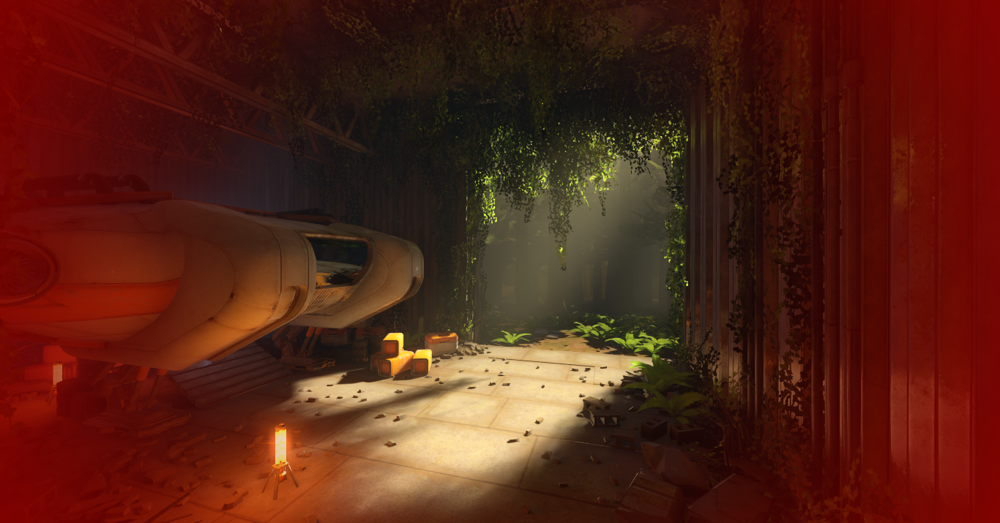
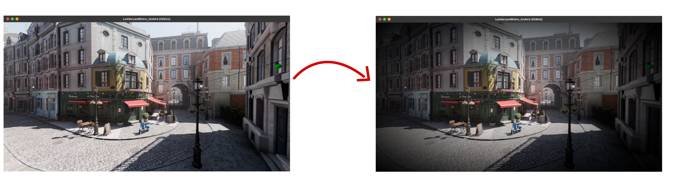
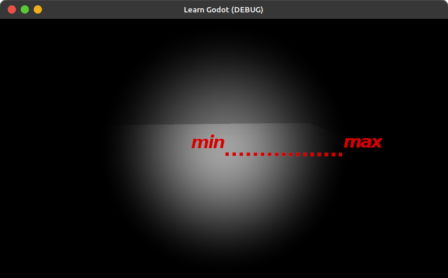
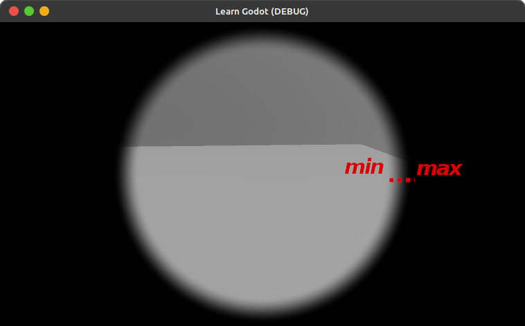
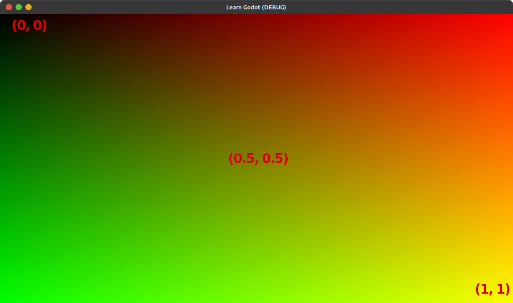

# Vignette

> a red tinted vignette effect


[Vignette](https://en.wikipedia.org/wiki/Vignetting#Post-shoot) is a technique used to draw the attention to the center of the image by darkening or blurring the corners or edges (towards the [periphery](https://en.wiktionary.org/wiki/periphery)) of the frame. this effect is often used to create a more dramatic or cinematic look.

## How It Works?
to create a vignette effect our fragment shader runs for every pixel and darkens it based on it's distance from the center of the screen.<br>


## The Recipe
add a new ColorRect and make it Fullscreen and add a new ShaderMaterial to it and create a new shader for it ([See How](./Chapters/Getting_Started/getting_started.html)).<br>
a new shader looks like this:
```glsl
shader_type canvas_item;

void fragment() {
	// Place fragment code here.
}

```
we add the following line above the```fragment```definition to declare a uniform that gives us access to the screen texture:
```glsl
uniform sampler2D SCREEN_TEXTURE : hint_screen_texture, filter_linear_mipmap;
```
### step 1: get the pixel distance from screen center
the```SCREEN_UV```is the current pixel's uv coordinates. uv coorditates are between 0-1 and therefore the center of the screen would be at (0.5, 0.5) coordinates.<br>
we get the distance of the current pixel from the center of the screen and store it in a variable called```dist```.
```glsl
float dist = distance(SCREEN_UV, vec2(0.5, 0.5));
```
>note that the calculated distance is not in *pixels* but instead a normalized(0-1) distance in uv coordinates. we could calculate the pixel position by multiplying the uv with```SCREEN_PIXEL_SIZE```but we won't cause we are going to use the distance as the interpolation factor and we need it to be normalized anyway.<br>
>we can use```vec2(0.5)```to get the center of the screen as well, the constructor will create a vec2 with 0.5 for both X and Y.

### step 2: create vignette mask
let's add two properties for controlling the radius and sharpness of the vignette.


```glsl
uniform float sharpness;
uniform float radius;
```
then we can use them in a smoothstep function to calculate the vignette mask value for this pixel.
```glsl
float vignette_mask = smoothstep(clamp(sharpness, 0, radius), radius, dist);
```

> smoothstep is a function that returns a smooth interpolation between a 'min' and a 'max' value based on the parameter(t). 
> if we have the sharpness property to be 0 and the radius to be 1, the interpolation goes from the center of the screen to the very corners. if we set the sharpness to be close the the radius value, say 0.9, then the interpolation doesn't start from the center of the screen but closer to the corners and therefore the vignette will become sharper. 

> 
> 

> however we don't want the sharpness value to be bigger than the radius since that would invert the interpolation (going from corners towards the center), so we clamp the sharpness to radius.

### step 3: darken the screen with the mask

we now can darken the current pixel based on the calculated mask. <br>
to do that we first sample the current pixel's color into a variable called ```screen``` like this:
```glsl
vec4 screen = texture(SCREEN_TEXTURE, SCREEN_UV);
```
and then we lerp it to ```vec4(0, 0, 0, 1)``` with the vignette mask as the interpolation factor (t parameter).<br>

```glsl
screen = mix(screen, vec4(0, 0, 0, 1), vignette_mask);
```
we can then assign the calculated color to this pixel:
```
COLOR = screen;
```
to be able to control the color of the vignette from the inspector, we can create a property for the shader called 'vignette_color':
```glsl
uniform vec4 vignette_color : source_color = vec4(0, 0, 0, 1);
```
> the ```source_color``` makes this vec4 show as a color in the material inspector.

and we use that in the lerp instead:
```
screen = mix(screen, vignette_color, vignette_mask);
```
<iframe id="video" width="100%" height="100%" src="./book_vignette_change_color.mp4" frameborder="0" allow="autoplay; encrypted-media" allowfullscreen=""></iframe>

### step 4: control vignette's shape
we calculated the distance of each pixel to the center of the screen with UV coordinates. and because UV coordinates go between 0-1 the vignette's shape will stretch to match the screen aspect ratio.<br>

> the distance from top to bottom, and left to right are both 1.0 and that's why the mask that's made with this UV will be stretched

let's add a property to our shader that controls whether the vignette is circular or not(circle or oval).
```
uniform bool circular = false;
```
if we want the vignette to be a circle, we need to respect the aspect ratio when calculating the distance.
we can calculate the aspect ratio like this:
```
vec2 aspect_ratio = vec2(1.0, SCREEN_PIXEL_SIZE.x / SCREEN_PIXEL_SIZE.y);
```
and now we can multiply the```SCREEN_UV```and the center coordinates (```vec2(0.5)```) with it if 'circular' is true:
```
float dist = 0.0;

if(circular)
	dist = distance(SCREEN_UV * aspect_ratio, vec2(0.5) * aspect_ratio);
else
	dist = distance(SCREEN_UV , vec2(0.5));

```
<iframe id="video" width="100%" height="100%" src="./book_vignette_circular.mp4" frameborder="0" allow="autoplay; encrypted-media" allowfullscreen=""></iframe>

> we can also write these lines shorter by getting the length of a vector going from center to the current pixel:

```glsl+
float dist = 0.0;

if(circular)
	dist = length((SCREEN_UV - vec2(0.5)) * vec2(1.0, SCREEN_PIXEL_SIZE.x/ SCREEN_PIXEL_SIZE.y));
else
	dist = length(SCREEN_UV - vec2(0.5));
```
> we can further shorten in by using a ternary operator instead of an if else statement:

```glsl
float dist = circular? length((SCREEN_UV - vec2(0.5)) * aspect_ratio) : distance(SCREEN_UV , vec2(0.5));
```

## keeping Height or Width?


keep width not changing
vec2(SCREEN_PIXEL_SIZE.y/ SCREEN_PIXEL_SIZE.x, 1.0)

keep height not changing
vec2(1.0, SCREEN_PIXEL_SIZE.x/ SCREEN_PIXEL_SIZE.y)


here's the final shader:
```glsl
shader_type canvas_item;

uniform sampler2D SCREEN_TEXTURE : hint_screen_texture, filter_linear_mipmap;
uniform float sharpness;
uniform float radius;
uniform bool circular = false;
uniform bool keep_height = true;
uniform vec4 vignette_color : source_color = vec4(0, 0, 0, 1);

void fragment() {
	
	vec2 aspect_ratio = keep_height? vec2(1.0, SCREEN_PIXEL_SIZE.x / SCREEN_PIXEL_SIZE.y) : vec2(SCREEN_PIXEL_SIZE.y / SCREEN_PIXEL_SIZE.x, 1.0);
	float dist = circular? length((SCREEN_UV - vec2(0.5)) * aspect_ratio) : distance(SCREEN_UV , vec2(0.5));
	
	float vigenette_mask = smoothstep(clamp(sharpness, 0, radius), radius, dist);
	vec4 screen = texture(SCREEN_TEXTURE, SCREEN_UV);
	screen = mix(screen, vignette_color, vigenette_mask);
	COLOR = screen;
}

```
